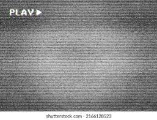

# xjia0641_9103_Tut9_GroupE Final Coding
## Functioning prototype

For my personal code, I chose to use Perlin noise to drive the animation. Perlin noise is great for animating various properties of an image. Also I added interactive properties. The user could start or pause the animation by holding(pressing) down the mouse.

Regarding the animation properties, I was inspired by the black and white screen of old TVs when they lost signal. I felt that Perlin noise was very suitable for such an effect.So I animated the color of the grid cells based on Perlin noise. The opacity of each grid cell, that is, the alpha value, will also be adjusted by Perlin noise, thus creating a dynamic effect.

Unlike other group members who used audio or interaction to drive animation, my approach was to use Perlin noise to create smooth animations. My animations were based on a grid system where each cell varied independently, creating a complex and evolving pattern. This is how noise was used to achieve effects similar to the loss of signal.

My inspiration comes from the screen distortion effect after a black and white TV loses its signal. These garbled characters and transparent color blocks will show smooth and continuous changes over time. This effect is very suitable for Perlin noise.

I didn't make many changes to the group code. I implemented the Perlin noise effect based on the group code. The three techniques mentioned above were implemented by me based on the class tutorials and looking for advanced tutorials on the Internet. Because the knowledge in the course could not allow me to produce such an effect.
My sources were ChatGPT and the tutorials on Perlin noise on Youtube.

I used noise initialization, using the function initializePerlinNoiseArray(seed) to set the seed and fill the array with Perlin noise values.
The myNoise(x,y) function is used to retrieve the noise value for a specific coordinate.
There is also the drawNoise() function that keeps updating the mesh based on the new Perlin noise value, changing both the color and opacity.
(Detailed comments are in the code.)

### Reference

The coding train(2017)Perlin Noise in p5.js
https://www.youtube.com/watch?v=Qf4dIN99e2w&list=PLRqwX-V7Uu6bgPNQAdxQZpJuJCjeOr7VD

The coding train(2019)Coding Challenge #136.1: Polar Perlin Noise Loops
https://www.youtube.com/watch?v=ZI1dmHv3MeM

Open AI(2024)ChatGPT
https://chatgpt.com/

Image:TV screen effect
https://www.google.com/url?sa=i&url=https%3A%2F%2Fwww.shutterstock.com%2Fsearch%2Ftv-screen-effect&psig=AOvVaw3dBy3x8pI11IAMMh8GI-MB&ust=1717240513845000&source=images&cd=vfe&opi=89978449&ved=0CBIQjRxqFwoTCPCMhcvht4YDFQAAAAAdAAAAABAE
